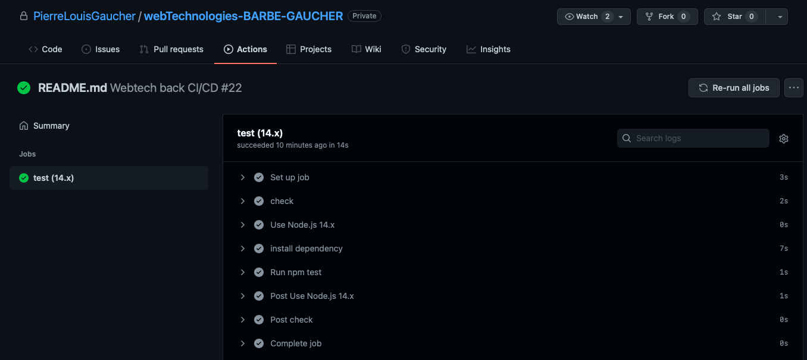
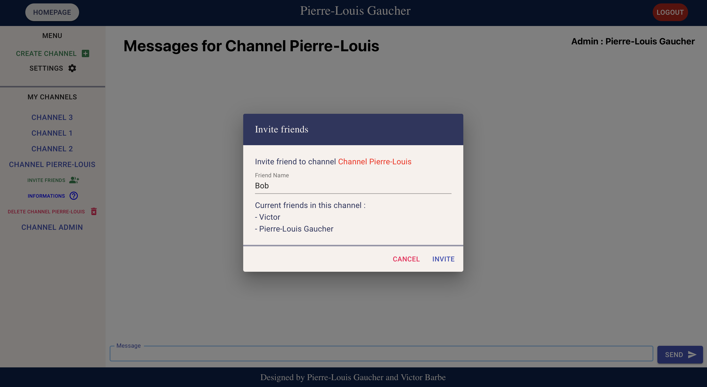

# Chat application - final project WebTechnologies

This README file will contain the explanations for the Chat-Application project of Victor Barbe and Pierre-louis Gaucher.

## How to start the application ?

- Inside `./dex-config/config.yml`, the front-end application is already registered and CORS is activated. Now that Dex is built and configured, we can start the Dex server:

If dex is located inside your project folder :

```
cd dex
bin/dex serve dex-config/config.yaml
```

Else :

```
cd dex
bin/dex serve [path_to_config.yaml]
```

- Start the back-end
  ```bash
  cd back-end
  # Install dependencies (use yarn or npm)
  yarn install
  # Optional, fill the database with initial data
  bin/init
  # Start the back-end
  bin/start
  ```
- Start the front-end
  ```bash
  cd front-end
  # Install dependencies (use yarn or npm)
  yarn install
  # Start the front-end
  yarn start
  ```

## Author

This project was designed by Victor Barbe and Pierre-louis Gaucher:

`victor.barbe@edu.ece.fr`
`pierrelouis.gaucher@edu.ece.fr`

## Tasks

Project management

- Naming convention

We followed the basic rules of naming convention: the variables names start with lowercase caracter, we seperate the different words in a variable with a uppercase caracter...

For the naming convention, we would attribute ourselves 2 points.

- Project structure

The file organisation of our repository is simple. There is a [`.github`](.github/workflows) folder containing the files necessary for the continuous integration part.
Then, there are three other folders for the [`back-end`](back-end), [`front-end`](front-end), [`dex-config`](dex-config) that contain all the necessary files for these parts.
Finally at the root of the project we can find the README explaining the project.

For the project structure, we would attribute ourselves 4 points.

- Code quality

For the code quality, we respected the implementation rules: no space in the middle of a function, one space between different functions. We made the code as organised and easily understandable as we could. We commented the main functions in the code and explained everything in the README.md

For the code quality, we would attribute ourselves 4 points.

- Design, UX

For the design part of the project, we wanted to aim for people that want to use their first chat application with many securities for different actions (delete, update...).
Everything has been done to be easy to use, with securities before removing anything from the database. For our welcome screen we decided to display a basic "Get Started" of the application. We mainly used material UI to make our application look modern and easy to use. We decided to go for a simple and minimalistic design to keep everything easy to use.
We also created a lot of CSS styling, to personalize our application and make it unique.

For the design and user experience, we would attribute ourselves 3,5 points.

- Git and DevOps

For the Git and Devops part, we decided to implement a CI pipeline. To do so, we created a `.github/workflows` folder which contains the [`main.yml`](.github/workflows/main.yml) file. Whenever we make a new commit and push it to the remote repository, github action will run the differents jobs that are desribed in the [`main.yml`](.github/workflows/main.yml) file. Indeed, github action will run the `npm test` script, that will run all the implemented unit tests. Now, when we are going to gitaction, we can see the process of CI. The tests described in the [`back-end/test`](back-end/test) folder are run each time somebody makes a commit to make sure new modifications are safe.

Here we can see our worflow making the tests to check if the new code works properly :

  

For the git and Devops part, we would attribute ourselves 2 points.

Application development

- Welcome screens

  We implemented a minimalist login page in which is only displayed the logo of the chat and a button to redirect to OpenId/oauth connexion.

  

  We implemented a easy-to-understand welcome page. This welcome page displays the caracteristics of ECE Chat and give you a quick "GET STARTED" tutorial in order to best start the experience. From this page, you also have access to all the features required in order to use ECE Chat : create channels, check your settings, switch between your channels...

  

  For the Welcome screens part, we would attribute ourselves 4 points.

- New channel creation

  New channel creation allow the user to create a channel with a custom name. He can also invite in this channel as much friends as he wants. While clicking on submit, a summary page pops up, displaying channel's name and all the friends that has been invited. You have choice to cancel or proceed the channel creation. The user who creates the channel is the admin of the page. The channel persists in the database with all its informations.

    

    

  For the New Channel Creation, we would attribute ourselves 6 points.

- Channel membership and access

  We havent started this part.

  For the Channel membership and access, we would attribute ourselves 0 points.

- Ressource access control

  When a user logs in, he will only have access to the channels he has been invited in or the one he has created. He can easily distinguish his messages send from the messages send by the users thanks to a different design of the chat message depending if you're the sender or the receiver. Also, not all members have the same rights. The creator of a channel becomes the admin of this channel. It means that only him is able to delete the channel. The other users can't delete it. If they try while they have no rights to do so, a pop up will appear asking them to contact the admin, displaying the admin name.

  

  As we can see, the user have access to this channel because his name (Pierre-Louis Gaucher) is located is the members list. However, he's not the admin, so he won't be able to delete this channel :

  

  If the user goes to a channel where he is admin, he will be authorized to delete this channel :

    

  For the Ressource Access Control, we would attribute ourselves 3,5 points. We doesn't give us the full grade because if the current user tries to connect to a channel he hasn't been invited in, he wont have access to the channel however he's not redirected to an error web page.

- Invite users to channels

  In the App, we can add new members at creation time of a channel as seen during channel creation, but also when the channel is already created.
  Members of a channel can invite other members to this channel. When they click on "Invite Friends", a pop up appears, asking the new friend to invite and displaying the current friend in the channel. You can either cancel or confirm the process. Once confirmed, the new member will be able to access to the channel and the new channel's informations persists in the database.

  

  As we can see, "Bob" has been correctly added to the channel

  

  For the Invite users to channels part, we would attribute ourselves 6 points.

- Message modification

  Users can modify their own (and only those ones) messages inside a channel. A "Edit" button next to the message they want to modify allows them to rewrite inside the message in order to modify it, and this for every message they sent in the channel. The updated message is now persistent in the database and every users will see the modification.

  Here, we're going to change the message "Going to change this message" into "Going to delete this message".

    

    

  For the Message Modification part, we would attribute ourselves 2 points.

- Message removal

  Users can delete their own (and only those ones) messages inside a channel. A "Delete" button next to the message they want to delete allows them to delete their message from the channel, and this for every message they sent in the channel. The message will be deleted from the database and the channel informations will be up to date.

  Here, we're going to delete the message we updated previously :

  

  

  For the Message removal, we would attribute ourselves 2 points.

- Account settings

  Settings displays informations about our user, such has is name, email, or personnal gravatar. We haven't implemented name modification (which easily leads to email modification, and even for image modification), however almost everything is done is the front in order to modify the user profile picture. This part is not complete.

  

  For the settings, we would attribute ourselves 2 points.

- Gravatar integration

  For this project, we implemented Gravatar in order to give to the user a profile picture. If the user have a Gravatar account, his profile picture will automatically set to the Gravatar picture which match with the user email. However if the user isn't registered on Gravatar, his profile picture will be a default gravatar. The user can use a button to be redirected to Gravatar website in order to register or change its Gravatar picture.

  For the Gravatar Integration, we would attribute ourselves 2 points.

- Avatar selection

  We've started the Avatar selection for our user. He can currently choose between new profile pictures provided by the app. If he clicks on a new picture, his current profile picture will be modificated but only in the front-end. Nothing is done in the back-end and so if the user refresh the page, his previous profile picture will be printed. We had trouble with the users database and so we've stopped here, while everything is the front-end is implemented (even if it will require some modification if the back-end works)

  

  For the Avatar selection, we would attribute ourselves 2 points.

- Personal custom avatar

  We havent started this part.

  For the Personnal custom avatar, we would attribute ourselves 0 points.

## Bonus

As said in the "Ressources Acces Control" part, we've implemented a channel removal method which wasn't required by the subject. Only the admin of the channel is able to use this feature, while the other will be stopped before deleting the channel.
